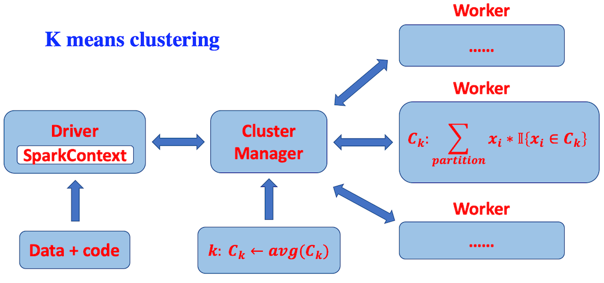

# Topic: Parallel Computing for Machine Learning
## Ben
### Machine learning, in general, is a statiscal approach to identify latent governing patterns in large datasets and make new discoveries with the uncovered patterns. However, the Internet today produces vast amount of data every second, and processing such enormous data with machine learning in real time is beyond the capibility of any single CPU human has created.
### One way to address the above issue is to utilize high performance distributed computing technique. Based on the idea of divide & conquer, if we can break the standard machine learning problem into smaller and more manageable independent jobs, we will be able to complete the task quickly in a parallel fasion.

### In this project, we explore a large family of machine learning algorithms, including supervised learning such as linear regression, logistic regression, random forrest, as well as unsupervised k-means clustering method. Our goal is to realize these algorithms using a popular parallel computing framework, i.e. Apache Spark.

# Distributed algorithms for machine learning

### Parallel computing framework we will use for this project is Apache Spark. The following figure illustrates how it works.

### Based on Apache Spark, we hope to realize distributed Machine Learning algorithms on multi-core, in order to take advantage of the massive computing power of modern computers and thus speed the learning process. The following shows 3 learning examples: linear regression, logistic regression and random forest.

### Example 1: how parallel linear regression works:
### (1) each worker performs in-memory partial summation on its own share of the data
### (2) cluster manager (master node) then sums all results from workers together and finds the inverse of the total matrix, and therefore computes the weight vector

### Example 2: how paralle logistic regression works:
### (1) each worker computes the gradient of loss function on its own partition of the data in memory
### (2) cluster manager sums all the partial gradients together and updates the weight vector
### (3) each worker re-comuptes the gradient, and send results to manager, until w converges or maximum iteration reached.

### Example 3: how parallel k-means clustering works:
### (1) manager maintains a global centroids (randomly initialized)
### (2) each worker clusters the data points in their memory and return (key, value) pairs where keys are the centroids and values are the average of the data points assigned to that centroid
### (3) manager updates each centroid via weighted average based on the clustering results from workers 

### Example 4: how parallel random forest works:
### (1) manager does bootstramp sampling and send different sampling of the data to each worker
### (2) each worker runs a decision tree with only a subset of the features from the data sample, in memory
### (3) manager combines the individual decision trees from each worker into a random forrest

# Expected results
### On multicore processors, after implementing common machine learning parallel algorithms, we will compare the time performce of single-core version algorithms with the parallel versions. Based on the references, time consumed during training should be reduced almost linearly depending on number of cores.

# What's next?
### 1. Although Spark is more popular in industry,  MPI performs better than spark on both communation time and execution time according to ref.2,
### 2. Implement parallel (deep) neural Network.

# References:
### 1. C.T. Chu, et al. Map-reduce for machine learning on multicore. NIPS'06 Proceedings of the 19th International Conference on Neural Information Processing Systems, 2006, 281-288.
### 2. S. Kamburugamuve, et al. Anatomy of machine learning algorithm implementations in MPI, Spark, and Flink. IJHPCA, 2018, 32, 61-73
